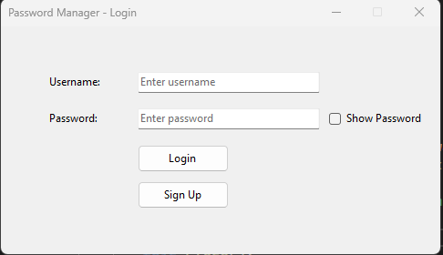
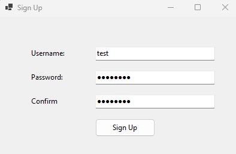
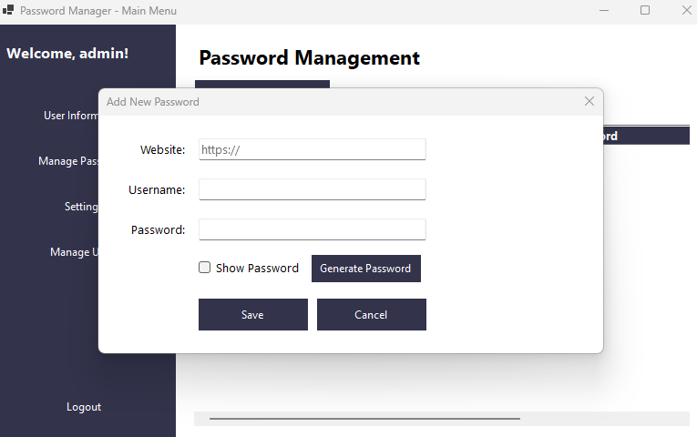
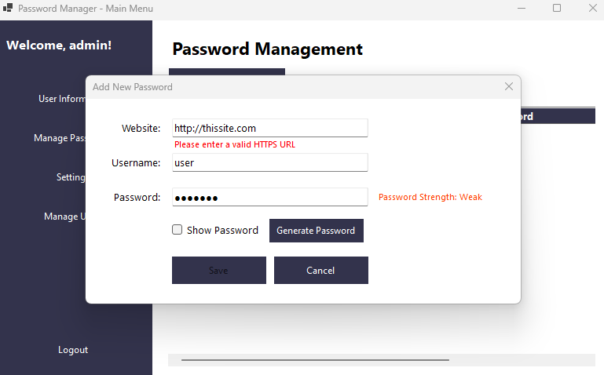
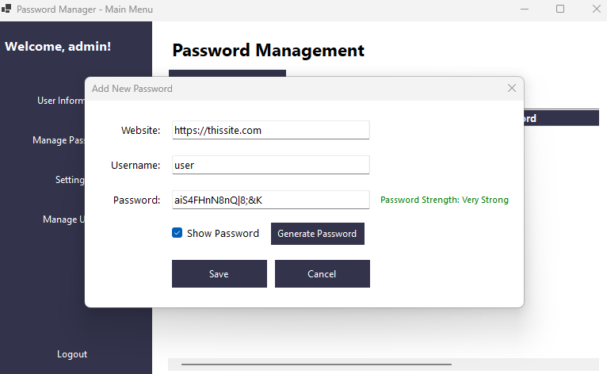
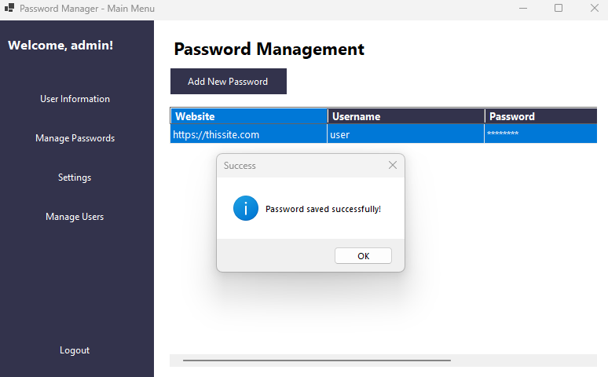
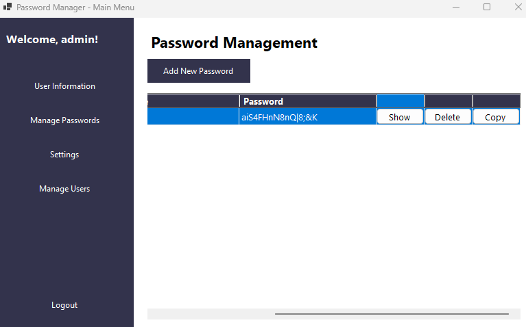
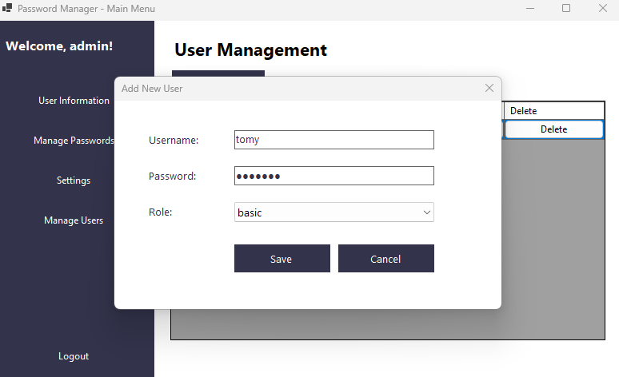
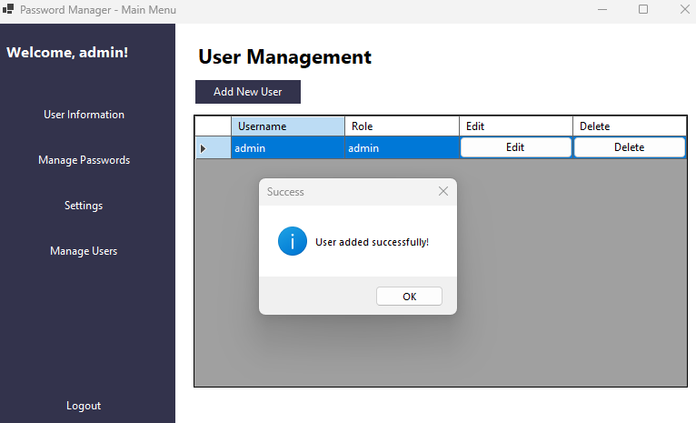
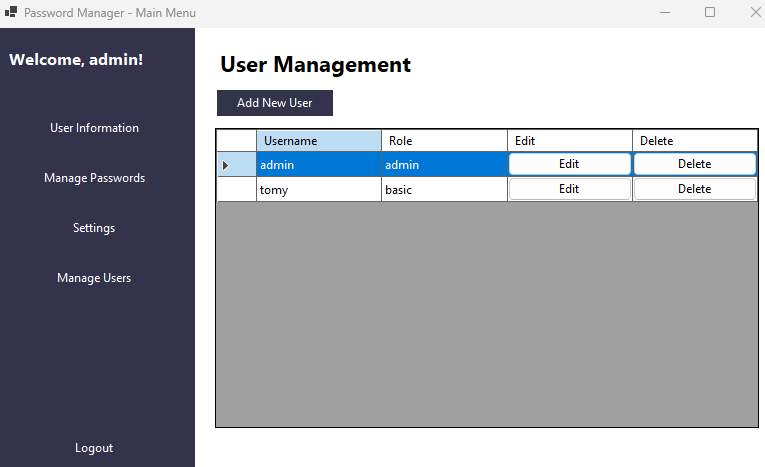

# Password Manager Application

A secure desktop password manager built with C# Windows Forms that allows users to safely store and manage their passwords with an emphasis on security and user-friendly interface.

## Features

### User Management
- Secure user authentication system
- Two-tier user roles (Admin and Basic)
- Admin capabilities to manage users
- Password encryption for user accounts

### Password Management
- Secure storage of website credentials
- HTTPS URL validation for website entries
- Password strength indicator
- Secure password generator
- Show/Hide password functionality
- Copy password to clipboard (auto-clears after 30 seconds)
- Password deletion capability

### Security Features
- Encrypted password storage
- Automatic clipboard clearing
- HTTPS-only website entries
- Password strength assessment
- Secure password generation algorithm

### User Interface
- Modern, intuitive design
- Responsive layout
- Clear visual feedback
- Easy-to-use navigation
- Dark theme styling

## Technical Requirements

- .NET Framework 4.7.2 or higher
- Windows Operating System
- SQL Server (Local or Express)
- Visual Studio 2019 or higher (for development)

## Installation

1. Clone the repository
```bash
git clone [repository-url]
```
Open the solution in Visual Studio

Update the database connection string in App.config

Run the database migration scripts (located in Database folder)

Build and run the application

## Database Setup

The application requires a SQL Server database. Run the following scripts in order:

1. **Create database schema
2. **Create tables
3. **Initialize admin user

## Usage

### First Time Setup

- Launch the application
- Login with default admin credentials:
    - **Username: admin
    - **Password: admin123

### Adding New Passwords

- Click "Manage Passwords"
- Click "Add New Password"
- Enter website URL (must be HTTPS)
- Enter username
- Either enter password manually or use password generator
- Click Save

### Managing Users (Admin Only)
- Click "Manage Users"
- Add, edit, or delete users
- Set user roles (admin/basic)

### Security Considerations

- All passwords are encrypted before storage
- Passwords are never stored in plain text
- HTTPS validation ensures secure website entries
- Clipboard content is automatically cleared
- Password strength is evaluated in real-time

Project Structure
```
PasswordManager/
│
├── Forms/
│   ├── LoginForm.cs
│   ├── MainForm.cs
│   └── ...
│
├── Database/
│   ├── DatabaseHelper.cs
│   └── ...
│
├── Models/
│   ├── User.cs
│   ├── Password.cs
│   └── ...
│
└── Utils/
    ├── Encryption.cs
    └── ...
```
### Contributing
- Fork the repository
- Create a feature branch
- Commit your changes
- Push to the branch
- Create a Pull Request

### Future Enhancements
- Password expiration notifications
- Two-factor authentication
- Password sharing capabilities
- Browser extension integration
- Backup and restore functionality
- Password import/export features

### Images on how the app works and it's functionalities













